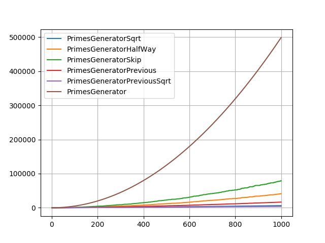

# PrimeNumbersPlotting
The objective of this project is to analyse distinct prime number generators algorithms in Python. This also explore the concepts of decorators and report generation using mathplotlib module.

## Primes generation reports examples

 100 elements report

 1000 elements report

 5 elements report
